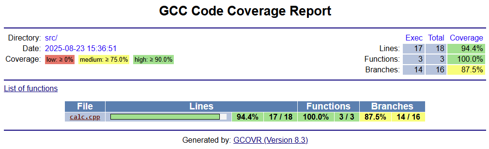

# Primes-CPP

Primes-CPP is a small C++ project designed to serve as a practical testbed for a complete CI pipeline. The codebase itself is intentionally simple: a minimal library with functions such as integer addition and prime number detection, a thin application entrypoint, and unit tests. By keeping the application itself simple, the project emphasizes the end-to-end automation flow from checkout to publish making it ideal for experimenting with toolchains, validating pipeline configurations, and serving as a template for larger C++ projects.

> For details on how this project is integrated into a full CI/CD workflow, refer to the [jenkins-pipeline](https://github.com/ManiAm/Jenkins-pipeline) project.

## Project Layout

The project is organized as follows:

    Project Root
    ├── src/                  # Core library source files
    │   ├── calc.h            # Header for calculator functions
    │   └── calc.cpp          # Implementation of calculator logic
    ├── app/                  # Application entry point(s)
    │   └── main.cpp          # Main program source
    ├── tests/                # Unit and integration tests
    │   └── test_calc.cpp     # Tests for calculator module
    ├── Makefile              # Build automation rules
    ├── .clang-format         # Code style configuration
    ├── conanfile.txt         # Conan package dependencies
    ├── Jenkinsfile           # CI pipeline definition
    ├── Dockerfile            # Container build definition
    └── docker-compose.yml    # Docker compose definition

### src/

This directory contains the source code and headers for the project. For a small codebase it is acceptable to keep headers alongside `.cpp` files. As the project grows, it is considered best practice to split public headers into an `include/` directory while keeping implementation files in `src/`. This allows usage like `-Iinclude` and `#include <calc/calc.h>`, which cleanly separates public APIs from internal code. Headers should use `#pragma once`, and compilation should enforce strict warning flags.

### app/

This directory contains entrypoints and runnable binaries. The `main.cpp` file is kept intentionally thin. It parses arguments and delegates logic to functions implemented in `src/`. If additional tools or CLIs are added in the future, place them here (e.g., `prime_cli.cpp`) to keep the core library testable and decoupled from input/output concerns.

### tests/

This directory contains unit tests for validating the behavior of code in `src/`. The project uses [Catch2](https://github.com/catchorg/Catch2) test framework, so `test_calc.cpp` both defines test cases and provides the test runner. Tests produce JUnit XML reports, which CI systems can use to visualize pass/fail status and track trends.

### Makefile

The Makefile defines one target per CI pipeline stage: format, lint, static, build, test, coverage, and package. This design ensures that the local developer workflow matches the pipeline exactly. The compiler can be switched easily (`CXX=clang++` or `CXX=g++`) without modifying the Makefile itself.

## Header File Dependencies

In C++ projects, header file dependencies are a critical aspect of reliable builds. When a header file is modified, every source file that includes it must be recompiled to ensure consistency. If the build system is unaware of these dependencies, it may skip recompilation, leaving behind stale object files. This can result in subtle issues such as mismatched symbols, linker errors, or even runtime crashes caused by outdated code.

For small projects, manually specifying which sources depend on which headers might be manageable, but in larger codebases this quickly becomes error-prone and difficult to maintain. Modern build workflows avoid this by automatically generating dependency files (commonly `.d` files produced by compilers with flags like `-MMD -MP` in GCC/Clang) and including them in the build process. With this approach, any change to a header automatically triggers recompilation of all dependent sources, keeping the build consistent without manual intervention.

While `Make` can handle dependency files effectively, other build systems such as CMake, Meson, or Bazel provide more advanced and integrated dependency tracking. These tools simplify large-scale builds by managing header dependencies transparently, improving correctness and developer productivity.

## C++ Package Managers

C++ lacks a standardized package management system like Python's `pip`, JavaScript's `npm` or Java's `Maven`. Manually managing dependencies often leads to errors, compatibility issues, and duplication. C++ package managers are specialized tools designed to manage C++ libraries and their dependencies in software development projects. They handle source code, prebuilt binaries, versioning, and build configurations, integrating with many build systems.

Among C++ package managers, [Conan](https://conan.io/) and [vcpkg](https://vcpkg.io/en/) are the most powerful and widely used tools. `Conan` is generally considered more powerful due to its customizability, enterprise features, and wider platform support. It is written in Python and is the industry standard for handling complex C++ projects. `vcpkg`, while simpler, is more suitable for smaller projects or Windows-based development where ease of setup and integration with Visual Studio are priorities. We are going to use Conan in our project.

## Getting Started

Start the container in background:

    docker compose up -d --build

Open an interactive shell to the container:

    docker exec -it primes-cpp bash

To run `clang-format` in verification mode:

    make format-check

It checks that all source files comply with the project’s `.clang-format` style. The command fails with an error if formatting is incorrect. It does not modify any files.

To run `clang-format` in in-place mode:

    make format

It automatically rewrites all source files to match the style rules in `.clang-format`.

To run `cpplint`:

    make lint

It reports style and convention issues beyond formatting (e.g., include order, naming, header guards). It does not modify files, only prints warnings or errors.

To run static code analysis using `cppcheck`:

    make static

The output is saved into `cppcheck.xml` file.

To compile the app:

    make -j build

To run a quick smoke test after building:

    make smoke

This will verify that it runs correctly and produces the expected minimal output. The smoke test acts as a lightweight sanity check before running the full test suite.

To run tests:

    make -j test

The test results are stored in `test-results` folder, and you can print it with:

    make test-console

To generate code coverage:

    make coverage

Open the `coverage` folder to view the coverage HTML report.

The `make package` target bundles everything produced by the pipeline into a single distributable artifact. It first ensures the project is built and tested, then collects the application binary, test results (e.g., JUnit XML), and analysis reports (e.g., `cppcheck.xml`). These files are packaged into a versioned tarball (named with the project’s Git tag or commit SHA) under the `dist/` directory, and a SHA-256 checksum file is generated for integrity verification. This provides a reproducible snapshot of the build, complete with binaries, reports, and metadata, suitable for archival or later publication.

    make package

## CI Pipeline

A `Jenkinsfile` is a plain text file, written in Groovy-based syntax, that defines a Jenkins pipeline as code. It specifies the stages, steps, and environment required to build, test, and deploy an application, providing a reproducible and version-controlled automation process directly alongside the source code. By treating the pipeline as code, teams gain consistency, collaboration, and traceability, since changes to the CI process are reviewed, versioned, and managed just like application code. Each branch, tag, or commit can carry its own pipeline definition, making the CI process fully reproducible and context-aware.

### Checkout

The checkout stage is the first step in most CI pipelines and is responsible for retrieving the project’s source code from version control. During this stage, the pipeline fetches the repository at the specific commit or branch associated with the build, ensuring that the build process runs against a consistent snapshot of the codebase. Depending on configuration, this may include checking out submodules, applying shallow clones to reduce network overhead, or verifying commit integrity for security.

### Code Formatting

Code formatting ensures that all source files follow a consistent, automated style. A formatter such as `clang-format` rewrites whitespace, indentation, line wrapping, and brace placement according to rules defined in a `.clang-format` file. Because formatting is deterministic and mechanical, style compliance should be non-negotiable across all branches and pull requests. Developers can use `make format` to automatically reformat files locally, while pre-commit hooks help catch violations before they enter the repository. In continuous integration, `make format-check` enforces compliance and ensures the codebase never drifts from the agreed standard.

### Linting

Linting checks source code for style, convention, and maintainability issues, but typically does not modify files. Linters enforce rules for naming, include ordering, modernization practices, and readability. Unlike a formatter, which only changes layout, linters flag constructs that violate established policy. This project uses `cpplint`, a Python-based tool created by Google for enforcing the Google C++ Style Guide. It provides fast feedback on issues such as missing copyright headers, incorrect include order, or discouraged language features.

There are also more advanced options such as `clang-tidy`. It integrates with the Clang compiler infrastructure and provides checks for readability, modern C++ usage, performance improvements, and even bug-prone constructs. It can suggest replacing raw loops with range-based for loops, flag use of deprecated APIs, detect certain memory misuses, and automatically apply fixes for many issues. While `cpplint` is lightweight and style-focused, `clang-tidy` is better suited for teams looking to enforce modernization and deeper semantic rules in larger or evolving C++ codebases.

### Static Code Analysis

Static analysis examines the semantics of a program without executing it. Unlike a formatter (which enforces layout) or a linter (which enforces conventions), static analysis focuses on program correctness: detecting uninitialized variables, null dereferences, memory leaks, portability problems, and potential performance pitfalls. This project uses `cppcheck`, a compiler-independent static analyzer designed specifically for C/C++. It produces both human-readable diagnostics and machine-readable XML output, which can be integrated into CI pipelines for trend tracking and reporting.

In CI/CD, it is best practice to treat serious findings (e.g., undefined behavior, memory safety issues) as build-breaking, while allowing style or lower-severity findings to surface as warnings for incremental cleanup. Running static analysis early in the pipeline provides fast feedback and conserves build resources by catching problems before compilation or runtime tests.

For larger or safety-critical projects, commercial solutions such as `Coverity` (by Synopsys) are also widely used. It provides deep, path-sensitive analysis that scales to millions of lines of code and integrates with enterprise CI/CD systems. It can detect complex defects such as concurrency issues, buffer overruns, resource leaks, and security vulnerabilities that might escape lightweight analyzers. In addition to diagnostics, it offers rich dashboards, compliance tracking (e.g., MISRA, CERT), and management workflows, making it suitable for regulated industries and large engineering organizations where code quality and traceability are non-negotiable.

### Build

The build stage compiles the project deterministically with strict flags (e.g., `-Wall -Wextra`). The Makefile provides a clear entrypoint and supports switching compilers (`g++` vs. `clang++`). For projects requiring portability, a compiler or OS matrix can be introduced. Build caches like `ccache` help accelerate repeated builds. The output binaries are placed in `build/bin/` and can be archived or passed to later stages (tests, packaging). Explicit dependency versions ensure that builds are reproducible and not subject to "works on my machine" failures.

### Smoke Test

A smoke test in C++ is a lightweight check performed immediately after a successful build to ensure that the compiled binary is minimally functional. It verifies that the application compiles, links, launches, and runs without crashing, and that basic output or initialization behaves as expected (for example, producing known console results or initializing key modules). The goal is not to validate correctness or cover all features, but simply to confirm that the build is healthy and executable (stable enough to proceed with unit or integration testing). A failing smoke test typically signals a critical issue such as a broken dependency, runtime crash, or mislinked library that must be resolved before deeper tests are worthwhile.

> The term originates from hardware engineering. When technicians powered on a newly assembled circuit board for the first time, their simplest test was to see whether it emitted smoke. If it did, something was fundamentally broken and they stopped there. This pragmatic check carried over into software engineering as a metaphor for catching catastrophic failures early. Today, in CI/CD pipelines, smoke tests serve as the first line of defense. They are fast, lightweight checks that prevent wasting time and resources on builds that are already "smoking".

### Unit Testing

Unit testing verifies the smallest components of the codebase (functions, classes, or modules) in isolation. These tests ensure that individual units behave as expected given specific inputs. Unit tests should avoid external dependencies such as databases or networks, making them fast to execute and deterministic in results. They provide developers with immediate feedback during local development and in CI pipelines.

In this project, the `Catch2` framework is used for unit testing, with `make test` as the entry point. Test runs generate JUnit XML output, which can be consumed by CI systems to visualize results, track historical trends, and highlight failures early in the development cycle.

### Code Coverage

Code coverage measures how much of the source is exercised by tests, reducing the risk of untested regressions. Coverage is not a direct measure of test quality, but it is a valuable indicator of risk. While striving for 100% coverage is often impractical and unnecessary, maintaining a high level of coverage ensures that critical paths are validated and reduces the likelihood of undetected regressions.

The project can be built with coverage flag (`--coverage`), after which tests are executed and coverage reports generated using `gcovr`. Reports should include both human-readable HTML and machine-readable formats (e.g., Cobertura XML) for automated enforcement. Coverage gates are best applied pragmatically: enforce no decrease relative to main or set thresholds per change, rather than rigid global minimums that encourage low-value tests.

### Documentation

Documentation is a critical component of any C++ project. Its purpose is to explain how the system is built, how to use it, and how others can extend or integrate with it. Clear documentation reduces onboarding time for new developers, helps users understand APIs and build procedures, and ensures long-term maintainability by preserving the reasoning behind design choices. Without proper documentation, even well-architected C++ code can become difficult to use or evolve, as implementation details often hide intent and constraints.

For this project, we are using Doxygen to generate documentation. [Doxygen](https://www.doxygen.nl/) is the most widely used documentation system in the C++ ecosystem. It parses source files and extracts specially formatted comments to generate structured documentation in HTML, PDF, or man page formats. Doxygen can integrate with CMake and can automatically cross-link class hierarchies, namespaces, function signatures, and dependency graphs using Graphviz.

### Package

When builds and tests succeed, outputs are bundled into distributable artifacts. These may include compressed archives (e.g., tarballs, ZIPs), operating system packages (DEB/RPM), or container images. Each artifact should be versioned using semantic versioning with optional commit metadata (e.g., `1.2.0+abc123`) to ensure traceability. To guarantee integrity, checksums (e.g., SHA-256) should be generated, and for supply chain security, additional metadata such as SBOMs (via tools like `syft`) and cryptographic signatures (via tools like `cosign`) can be attached. A well-packaged artifact is minimal containing only the files and dependencies required by consumers and should include concise documentation or metadata describing runtime requirements.

### Integration Testing

Integration testing validates that multiple components work correctly when combined. While unit tests prove correctness in isolation, integration tests catch issues that only appear when components interact. For example, a parser feeding data into a calculator or application code calling into a database. Integration tests may involve real or simulated dependencies and tend to run slower than unit tests, but they are critical for uncovering systemic issues.

A popular analogy highlights the difference between unit and integration testing. Imagine a door secured by both a lock and a latch. A unit test checks that the latch closes correctly when tested in isolation, while an integration test verifies that the latch and the door handle together actually keep the door secure. This distinction illustrates why both levels of testing are needed for confidence in a system’s overall behavior.

### Regression Testing

Regression testing is the process of re-executing previously run test cases to ensure that recent code changes, enhancements, or bug fixes have not unintentionally broken existing functionality. Unlike unit or integration testing, which focus on specific levels of the software (individual components or their interactions), regression testing is a testing strategy applied across all levels. Its primary goal is to confirm that the system continues to behave as expected after modifications.

In practice, regression testing often involves maintaining a suite of automated tests (ranging from unit tests to full end-to-end scenarios) that are rerun whenever the codebase changes. This ensures that new features integrate smoothly, bug fixes do not reappear, and overall system stability is preserved. Because it validates the unchanged parts of a system after updates, regression testing is critical in CI/CD pipelines, where frequent changes must not compromise reliability.

### Publish

Publishing makes validated artifacts available to others by promoting them to their designated destinations under controlled conditions. Targets may include package repositories (e.g., Artifactory, Nexus, PyPI, Maven Central), container registries (e.g., Docker Hub, ECR, GCR), or distribution platforms such as GitHub Releases. Publishing credentials must follow the principle of least privilege and be rotated regularly. Published artifacts should be annotated with changelogs, version tags, and links back to the originating build for full traceability. To strengthen consumer trust, optional metadata such as SLSA provenance attestations, SBOMs, and digital signatures should be attached so downstream systems and users can verify authenticity and integrity before deployment.

### Release

A release marks the formal distribution of a software version to end users, distinguishing it from internal builds or unpublished artifacts. A release is both a technical milestone and a product event, usually represented by a semantic version tag (e.g., `v1.2.0`) in source control. It should be immutable, reproducible, and traceable to a specific commit and build pipeline. A proper release includes release notes summarizing new features, bug fixes, and breaking changes, ideally auto-generated from commits or pull requests. Distribution is handled through established channels such as GitHub/GitLab Releases, customer portals, or internal delivery pipelines. In mature CI processes, releases are gated by quality controls (security scans, compliance checks, stakeholder approvals) and may trigger downstream workflows such as deployment to production or notifications to customers.

In summary:

- Package → Create artifacts
- Publish → Push artifacts to repositories/registries
- Release → Tag and announce an official version for end users

## Ephemeral Docker Build Environment

The Jenkins pipeline is designed so that all build, test, and analysis stages run inside ephemeral Docker containers rather than directly on the Jenkins agent. At the start of the pipeline, Jenkins builds the project’s Docker image (as defined in the Dockerfile) to encapsulate the full toolchain, dependencies, and runtime environment. Subsequent stages in the Jenkinsfile are executed inside disposable containers instantiated from this freshly built image. This workflow ensures several advantages:

- **Clean Separation of Concerns**: The Jenkins agents only need Docker installed; they do not require any compilers, libraries, or runtimes. All dependencies remain confined within the container image.

- **Consistency and Reproducibility**: Because the image is built from a version-controlled Dockerfile, every pipeline run uses the exact same environment. This eliminates "works on my machine" issues and ensures reproducible builds across agents.

- **Polyglot Flexibility**: Different pipelines can provide different Dockerfiles, making it straightforward to support multiple languages or toolchains without cross-contamination.

- **Stateless Execution**: Containers are ephemeral. Once a stage completes, the container is discarded, leaving no residual state behind. Each run starts from a clean, deterministic environment, which improves the reliability of test results, static analysis, and coverage reports.

By adopting this model, the pipeline guarantees that the CI process remains portable, maintainable, and free from dependency drift, while still enabling Jenkins to orchestrate the stages inside containerized environments.
